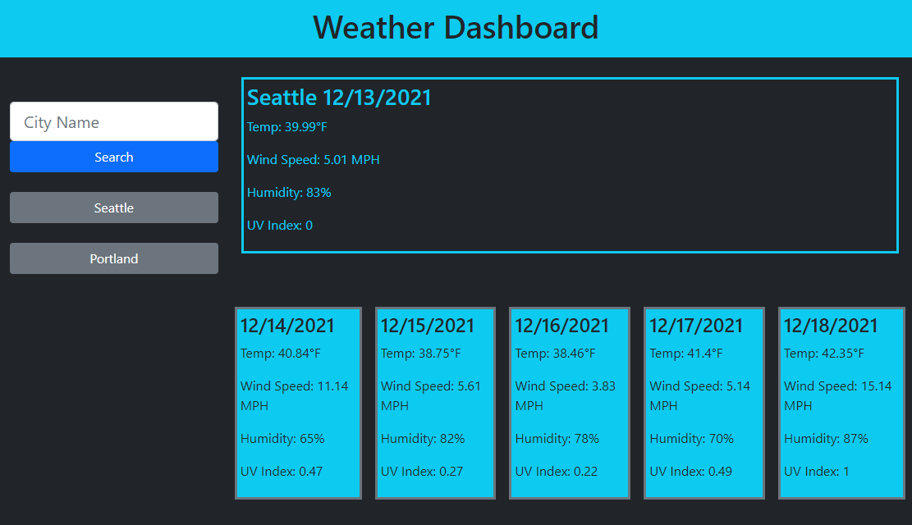

# Weather-Dashboard
A 5-day weather app with accesss to multiple cities.
type a city name and see the weather data for that city.

it could use a bit of a style upadate and the previous searches only appear as buttons if you refresh the page, but it functions.

My GitHub repo: [https://github.com/Billygm/Weather-Dashboard](https://github.com/Billygm/Weather-Dashboard)

Live Page: [https://billygm.github.io/Weather-Dashboard/](https://billygm.github.io/Weather-Dashboard/)